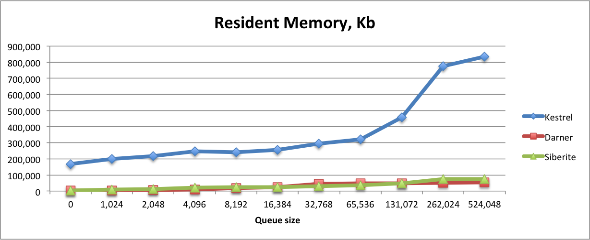
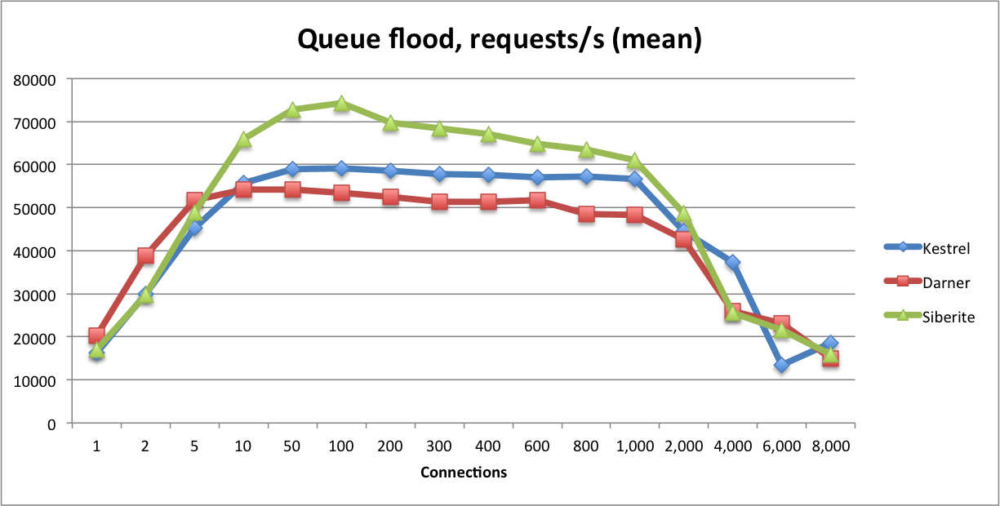
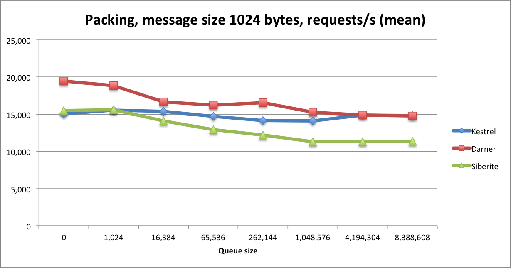
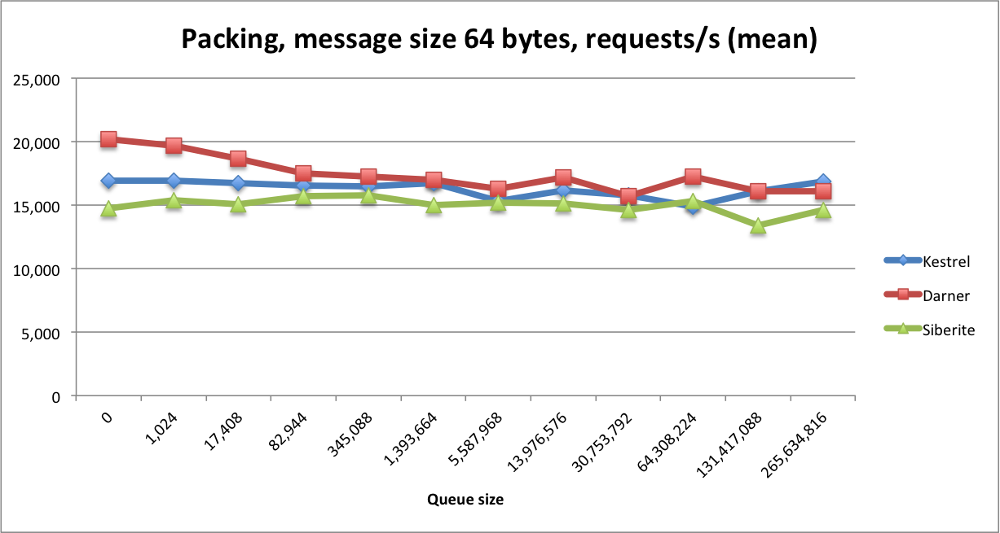
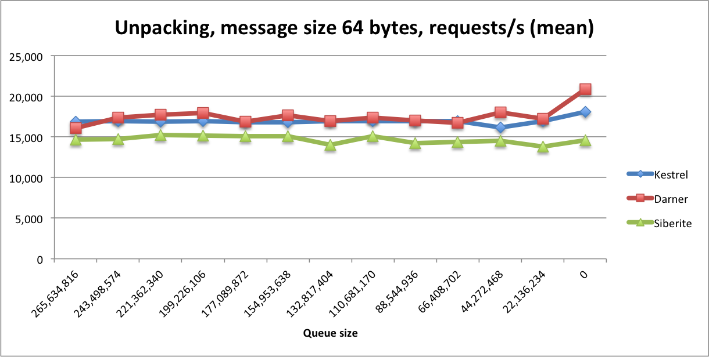

Benchmark Details:
* MacBook Pro CPU: 2.2 GHz Intel Core i7, RAM: 16 GB 1600 MHz DDR3, Disk: SSD
* OS X Yosemite 10.10.5
* Kestrel 2.4.8, Java 1.6.0_65, -Xmx1024m
* Darner 0.2.5 [Innometrics/darner](https://github.com/Innometrics/darner) built with RocksDB
* Siberite 0.5.1

# Resident Memory

How much memory does the queue server use?  We are testing both steady-state memory resident, and also how aggressively
the server acquires and releases memory as queues expand and contract.
Kestrel memory settings: `-Xmx1024m`.



```
$ ./mem_rss.sh
kestrel        0 requests: 186640 kB
kestrel     1024 requests: 225440 kB
kestrel     2048 requests: 226864 kB
kestrel     4096 requests: 240208 kB
kestrel     8192 requests: 249720 kB
kestrel    16384 requests: 272672 kB
kestrel    32768 requests: 370124 kB
kestrel    65536 requests: 465836 kB
kestrel   131072 requests: 636508 kB
kestrel   262024 requests: 763916 kB
kestrel   524048 requests: 840048 kB

darner         0 requests: 2844 kB
darner      1024 requests: 4644 kB
darner      2048 requests: 6880 kB
darner      4096 requests: 9152 kB
darner      8192 requests: 17296 kB
darner     16384 requests: 25052 kB
darner     32768 requests: 44384 kB
darner     65536 requests: 45708 kB
darner    131072 requests: 48988 kB
darner    262024 requests: 50668 kB
darner    524048 requests: 54024 kB

siberite         0 requests: 3216 kB
siberite      1024 requests: 10568 kB
siberite      2048 requests: 16984 kB
siberite      4096 requests: 22400 kB
siberite      8192 requests: 38416 kB
siberite     16384 requests: 50384 kB
siberite     32768 requests: 53912 kB
siberite     65536 requests: 62280 kB
siberite    131072 requests: 68304 kB
siberite    262024 requests: 87908 kB
siberite    524048 requests: 93868 kB
```

# Queue Flooding

How quickly can we flood items through 10 queues?  This tests the raw throughput of the server.



```
$ ./flood.sh
warming up kestrel...done.
kestrel      1 conns: 16999
kestrel      2 conns: 31427
kestrel      5 conns: 45621
kestrel     10 conns: 58320
kestrel     50 conns: 60848
kestrel    100 conns: 61386
kestrel    200 conns: 61653
kestrel    300 conns: 62213
kestrel    400 conns: 61544
kestrel    600 conns: 60760
kestrel    800 conns: 60060
kestrel   1000 conns: 60238
kestrel   2000 conns: 57317
kestrel   4000 conns: 53794
kestrel   6000 conns: 33423
kestrel   8000 conns: 14921

darner       1 conns: 20759
darner       2 conns: 40485
darner       5 conns: 53974
darner      10 conns: 55463
darner      50 conns: 56427
darner     100 conns: 54964
darner     200 conns: 50006
darner     300 conns: 53547
darner     400 conns: 50913
darner     600 conns: 50211
darner     800 conns: 48789
darner    1000 conns: 46738
darner    2000 conns: 41843
darner    4000 conns: 24389
darner    6000 conns: 23948
darner    8000 conns: 15980

siberite       1 conns: 16947
siberite       2 conns: 30316
siberite       5 conns: 48104
siberite      10 conns: 65828
siberite      50 conns: 72513
siberite     100 conns: 74224
siberite     200 conns: 70746
siberite     300 conns: 69121
siberite     400 conns: 68170
siberite     600 conns: 65776
siberite     800 conns: 64164
siberite    1000 conns: 61821
siberite    2000 conns: 49407
siberite    4000 conns: 23952
siberite    6000 conns: 24418
siberite    8000 conns: 15984
```

# Queue Packing (1024 byte message size)

This tests the queue server's behavior with a backlog of items.  The challenge for the queue server is to serve items
that no longer all fit in memory.  Absolute throughput isn't important here - item sizes are large to quickly saturate
free memory.  Instead it's important for the throughput to flatten out as the backlog grows.




```
$ ./packing.sh
warming up kestrel...done.
kestrel        0 sets: 16278
kestrel     1024 sets: 16523
kestrel    16384 sets: 16540
kestrel    65536 sets: 16376
kestrel   262144 sets: 15182
kestrel  1048576 sets: 15386
kestrel  4194304 sets: 15060
kestrel  8388608 sets: 15116

darner        0 sets: 17388
darner     1024 sets: 16521
darner    16384 sets: 14525
darner    65536 sets: 13189
darner   262144 sets: 12856
darner  1048576 sets: 15290
darner  4194304 sets: 14990
darner  8388608 sets: 14756

siberite        0 sets: 16084
siberite     1024 sets: 15886
siberite    16384 sets: 14600
siberite    65536 sets: 13507
siberite   262144 sets: 12944
siberite  1048576 sets: 12486
siberite  4194304 sets: 12508
siberite  8388608 sets: 12316
```

# Queue Packing and Unpacking (64 byte message size)

The challenge for the queue server is to serve items that no longer all fit
in memory. And to make sure that leveldb performance doesn't degrade because of
large number of delete queries.






```
kestrel | items:          0 | speed:    16927 ops/s
kestrel | items:       1024 | speed:    16953 ops/s
kestrel | items:      17408 | speed:    16717 ops/s
kestrel | items:      82944 | speed:    16560 ops/s
kestrel | items:     345088 | speed:    16492 ops/s
kestrel | items:    1393664 | speed:    16731 ops/s
kestrel | items:    5587968 | speed:    15302 ops/s
kestrel | items:   13976576 | speed:    16144 ops/s
kestrel | items:   30753792 | speed:    15779 ops/s
kestrel | items:   64308224 | speed:    14888 ops/s
kestrel | items:  131417088 | speed:    16094 ops/s
kestrel | items:  265634816 | speed:    16846 ops/s
kestrel | items:  243498574 | speed:    16907 ops/s
kestrel | items:  221362340 | speed:    16874 ops/s
kestrel | items:  199226106 | speed:    16956 ops/s
kestrel | items:  177089872 | speed:    16826 ops/s
kestrel | items:  154953638 | speed:    16819 ops/s
kestrel | items:  132817404 | speed:    16924 ops/s
kestrel | items:  110681170 | speed:    16942 ops/s
kestrel | items:   88544936 | speed:    16940 ops/s
kestrel | items:   66408702 | speed:    16953 ops/s
kestrel | items:   44272468 | speed:    16159 ops/s
kestrel | items:   22136234 | speed:    16928 ops/s
kestrel | items:          0 | speed:    18098 ops/s

darner | items:          0 | speed:    20223 ops/s
darner | items:       1024 | speed:    19658 ops/s
darner | items:      17408 | speed:    18686 ops/s
darner | items:      82944 | speed:    17521 ops/s
darner | items:     345088 | speed:    17248 ops/s
darner | items:    1393664 | speed:    16978 ops/s
darner | items:    5587968 | speed:    16299 ops/s
darner | items:   13976576 | speed:    17190 ops/s
darner | items:   30753792 | speed:    15707 ops/s
darner | items:   64308224 | speed:    17279 ops/s
darner | items:  131417088 | speed:    16091 ops/s
darner | items:  265634816 | speed:    16080 ops/s
darner | items:  243498574 | speed:    17390 ops/s
darner | items:  221362340 | speed:    17705 ops/s
darner | items:  199226106 | speed:    17944 ops/s
darner | items:  177089872 | speed:    16877 ops/s
darner | items:  154953638 | speed:    17661 ops/s
darner | items:  132817404 | speed:    16966 ops/s
darner | items:  110681170 | speed:    17402 ops/s
darner | items:   88544936 | speed:    17008 ops/s
darner | items:   66408702 | speed:    16710 ops/s
darner | items:   44272468 | speed:    18028 ops/s
darner | items:   22136234 | speed:    17244 ops/s
darner | items:          0 | speed:    20864 ops/s

siberite | items:          0 | speed:    17292 ops/s
siberite | items:       1024 | speed:    16288 ops/s
siberite | items:      17408 | speed:    15470 ops/s
siberite | items:      82944 | speed:    15144 ops/s
siberite | items:     345088 | speed:    15209 ops/s
siberite | items:    1393664 | speed:    14344 ops/s
siberite | items:    5587968 | speed:    15191 ops/s
siberite | items:   13976576 | speed:    14833 ops/s
siberite | items:   30753792 | speed:    15883 ops/s
siberite | items:   64308224 | speed:    15127 ops/s
siberite | items:  131417088 | speed:    14557 ops/s
siberite | items:  265634816 | speed:    15677 ops/s
siberite | items:  243498574 | speed:    15827 ops/s
siberite | items:  221362340 | speed:    15964 ops/s
siberite | items:  199226106 | speed:    16067 ops/s
siberite | items:  177089872 | speed:    16022 ops/s
siberite | items:  154953638 | speed:    16025 ops/s
siberite | items:  132817404 | speed:    16348 ops/s
siberite | items:  110681170 | speed:    16166 ops/s
siberite | items:   88544936 | speed:    16288 ops/s
siberite | items:   66408702 | speed:    16365 ops/s
siberite | items:   44272468 | speed:    16272 ops/s
siberite | items:   22136234 | speed:    16250 ops/s
siberite | items:          0 | speed:    17630 ops/s
```
